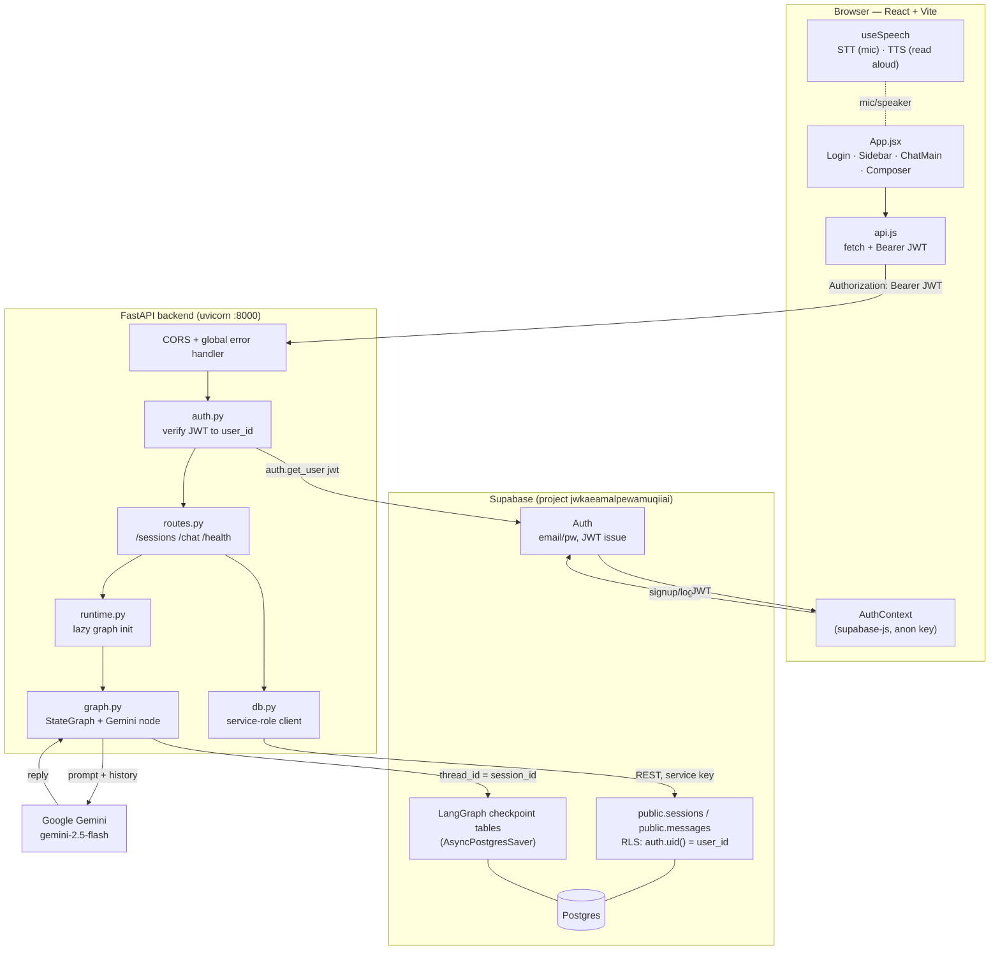
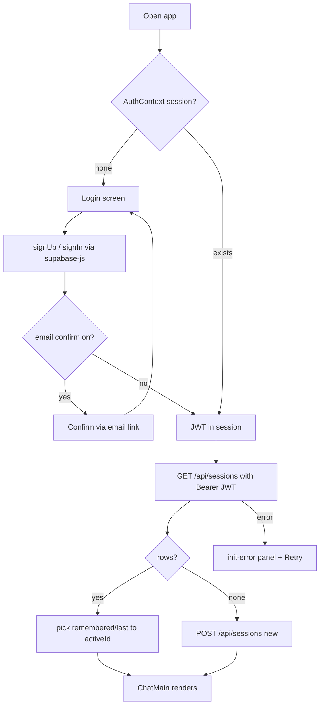
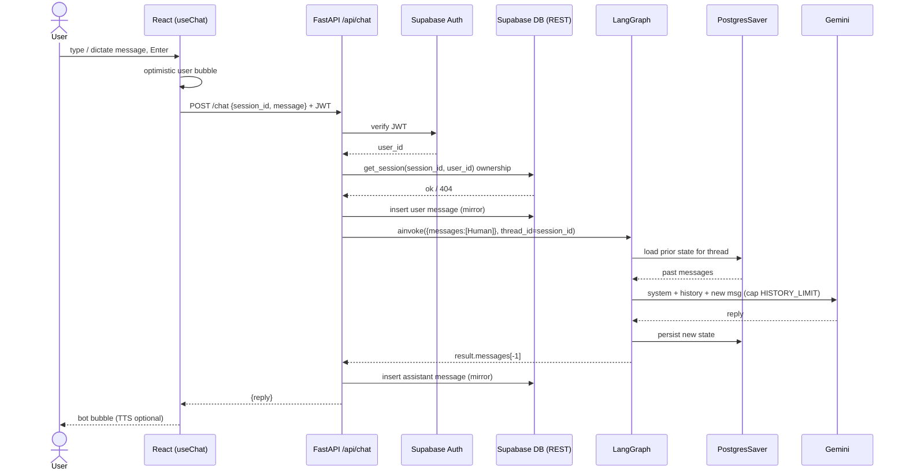
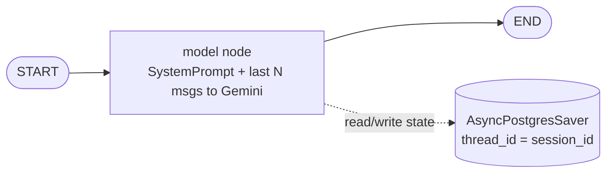

# Project Flow — Context-Aware Chatbot (Axis)

Detailed flow of the system. Diagrams mirror the actual code
(`backend/app/*`, `frontend/src/*`).

---

## 1. System architecture

---

## 2. Login + session bootstrap

---

## 3. Chat message round-trip (core)

---

## 4. LangGraph internal

---

## Design notes

- **Dual storage:** `public.messages` is the RLS-owned source of truth for the
  UI (sidebar list, rendered history). The LangGraph `AsyncPostgresSaver`
  checkpointer holds the model's working memory. Both live in the same
  Supabase Postgres but serve different purposes.
- **Context-aware:** the checkpointer auto-loads thread state keyed by
  `thread_id == session_id`, so Gemini always answers with the full
  conversation. History is capped to the last `HISTORY_LIMIT` turns for
  cost/latency.
- **Session isolation:** each chat is a separate `session_id` = separate
  LangGraph thread. No cross-chat memory by design (matches the requirement
  "stores conversation per user session").
- **Security:** the browser only ever holds the public anon key. The backend
  verifies the Supabase JWT on every request, scopes all queries by
  `user_id`, and RLS (`auth.uid() = user_id`) is enabled as defense-in-depth.
- **Voice:** STT uses the browser `SpeechRecognition` API (Chromium only —
  Brave blocks it). TTS uses `speechSynthesis` (works everywhere). Both are
  client-side; no backend involvement.
- **Serverless-safe:** the LangGraph graph + DB connection initialize lazily
  on first request (`runtime.py`) and are cached per process, so Vercel
  serverless cold starts work without relying on ASGI lifespan.
