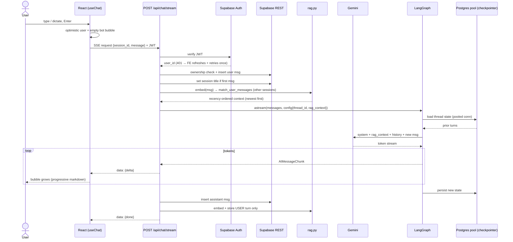
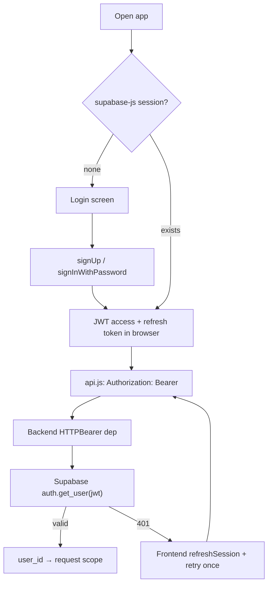
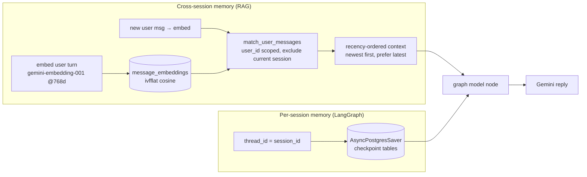
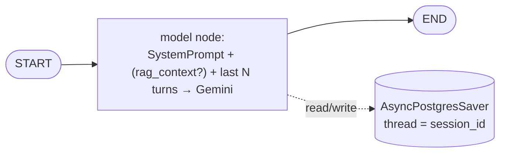
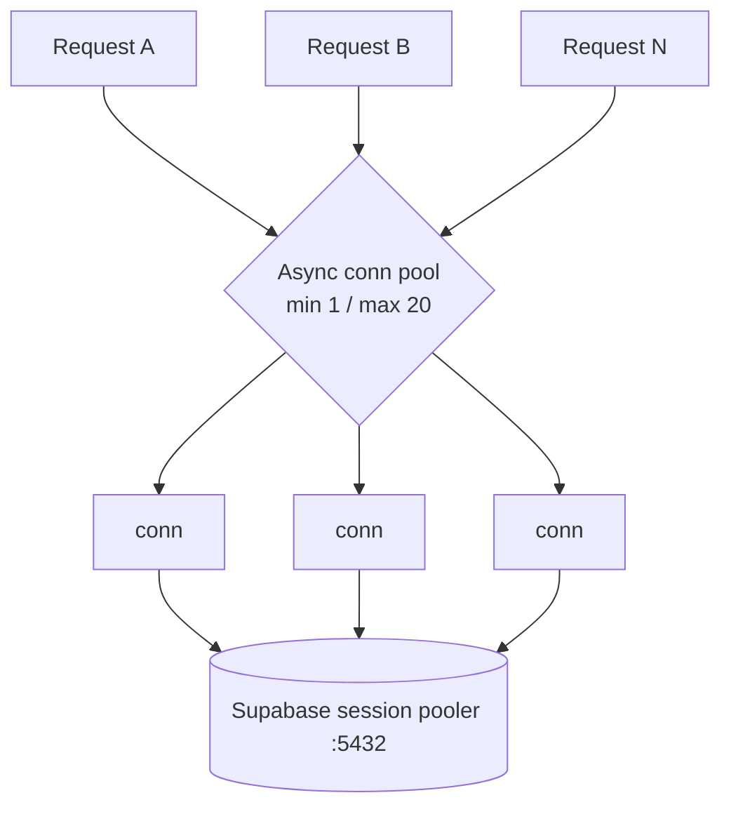
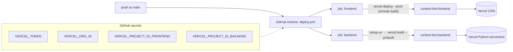

# Xccelera · Axis — Architecture & System Documentation

Context-aware chatbot. Per-session conversation memory (LangGraph) **plus**
cross-session recall (RAG over pgvector), real auth, streaming responses,
auto-deployed to Vercel via CI/CD.

- **Frontend**: React + Vite, Supabase JS (auth)
- **Backend**: FastAPI, LangGraph, Google Gemini
- **Data**: Supabase — Postgres + Auth + `pgvector`
- **Infra**: GitHub Actions → 2 Vercel projects

---

## 1. System overview

```mermaid
flowchart TB
    subgraph Client["Browser — React/Vite SPA"]
        UI["App / ChatMain / Sidebar / Login"]
        AC["AuthContext (supabase-js, anon key)"]
        SP["useSpeech — STT mic / TTS"]
        APIc["api.js — fetch, Bearer JWT, 401 auto-refresh"]
    end

    subgraph Vercel["Vercel (CDN + Serverless)"]
        FE["Static frontend (context-bot-frontend)"]
        BE["FastAPI serverless (context-bot-backend)"]
    end

    subgraph Supabase["Supabase — project jwkaeamalpewamuqiiai"]
        AUTH["Auth (JWT issuer)"]
        PG[("Postgres")]
        T1["sessions / messages (RLS)"]
        T2["message_embeddings (pgvector, RLS)"]
        T3["LangGraph checkpoint tables"]
    end

    GEM["Google Gemini<br/>gemini-2.5-flash + gemini-embedding-001"]

    UI --> APIc
    AC -->|sign up / in| AUTH
    AUTH -->|JWT| AC
    APIc -->|HTTPS + Bearer JWT| BE
    FE -. served .- UI
    BE -->|verify JWT| AUTH
    BE -->|service key, REST| T1
    BE -->|embeddings + vector search| T2
    BE -->|checkpointer (conn pool)| T3
    BE -->|chat + embed| GEM
    T1 --- PG
    T2 --- PG
    T3 --- PG
```

---

## 2. Backend modules

| Module | Responsibility |
|---|---|
| `app/main.py` | FastAPI app, CORS, lifespan, global error handler |
| `app/config.py` | Env settings (pydantic-settings) |
| `app/auth.py` | Bearer dependency → verifies Supabase JWT → `user_id` |
| `app/db.py` | Supabase REST (service key): sessions, messages, titles |
| `app/graph.py` | LangGraph `StateGraph`; Gemini node; injects RAG context |
| `app/runtime.py` | Lazy graph init; **async Postgres connection pool** checkpointer |
| `app/rag.py` | Gemini embeddings; store user turns; recency-aware retrieval |
| `app/routes.py` | `/sessions`, `/chat`, `/chat/stream`, `/health` |
| `api/index.py` | Vercel ASGI entry |

---

## 3. Request lifecycle — streaming chat



---

## 4. Authentication



- Browser only ever holds the **public anon key**.
- Backend uses **service-role key**, bypasses RLS, but scopes every query by
  the verified `user_id`. RLS still enabled as defense-in-depth.

---

## 5. Memory model — two layers



- **Per-session**: full thread history, exact, via checkpointer.
- **Cross-session**: top-K (6) similar **user** statements from the user's
  *other* sessions, cosine ≥ 0.6, ordered newest-first; the model is told to
  trust the most recent on conflict. Only **user** turns are embedded
  (assistant text added refusal/noise to similarity search).

---

## 6. LangGraph internal



`rag_context` is passed per-request via `config.configurable` — ephemeral,
not persisted into thread state.

---

## 7. Data model

```mermaid
erDiagram
    auth_users ||--o{ sessions : owns
    sessions ||--o{ messages : contains
    sessions ||--o{ message_embeddings : has
    messages ||--|| message_embeddings : "user turns only"

    auth_users { uuid id }
    sessions {
        uuid id PK
        uuid user_id FK
        text title
        timestamptz created_at
    }
    messages {
        uuid id PK
        uuid session_id FK
        text role "user|assistant"
        text content
        timestamptz created_at
    }
    message_embeddings {
        uuid message_id PK_FK
        uuid user_id FK
        uuid session_id FK
        text role
        text content
        vector embedding "768"
        timestamptz created_at
    }
```

Plus LangGraph's own `checkpoints*` tables (managed by
`AsyncPostgresSaver.setup()`), keyed by `thread_id = session_id`.

RLS: `sessions`/`messages` → `auth.uid() = user_id`;
`message_embeddings` → `auth.uid() = user_id`.

---

## 8. Concurrency model



- Earlier bug: single shared checkpointer connection → second concurrent
  user blocked. Fixed with `psycopg_pool.AsyncConnectionPool`.
- Frontend: expired JWT → `api.js` refreshes session + retries once
  (no silent dead requests).
- Serverless: graph + pool init lazily per cold start (`runtime.py`).

---

## 9. Deployment & CI/CD



Key CI gotchas (resolved):
- Backend needs `astral-sh/setup-uv` (Vercel Python build requires `uv`).
- Frontend must use **remote** `vercel deploy` (not `--prebuilt`) so Vercel
  injects `VITE_*` Project env into the Vite build (prebuilt path shipped a
  blank page with `localhost` fallback baked in).

Live:
- Frontend `https://context-bot-frontend.vercel.app`
- Backend `https://context-bot-backend.vercel.app`

---

## 10. API reference

All `/api/*` except `/api/health` require `Authorization: Bearer <jwt>`.

| Method | Path | Body | Returns |
|---|---|---|---|
| GET | `/api/health` | — | `{status}` |
| POST | `/api/sessions` | `{title?}` | created session |
| GET | `/api/sessions` | — | user's sessions |
| GET | `/api/sessions/{id}/messages` | — | ordered history |
| POST | `/api/chat` | `{session_id, message}` | `{session_id, reply}` |
| POST | `/api/chat/stream` | `{session_id, message}` | SSE: `{delta}` … `{done}` / `{error}` |

---

## 11. Environment

**Backend** (`backend/.env` / Vercel Project env):
`GEMINI_API_KEY`, `GEMINI_MODEL`, `SUPABASE_URL`, `SUPABASE_SERVICE_KEY`,
`SUPABASE_DB_URL`, `HISTORY_LIMIT`, `CORS_ORIGINS`.

**Frontend** (`frontend/.env` / Vercel Project env):
`VITE_API_BASE_URL`, `VITE_SUPABASE_URL`, `VITE_SUPABASE_ANON_KEY`.

Constraints:
- `SUPABASE_DB_URL` = **Session pooler** (`...pooler.supabase.com:5432`).
  Direct host is IPv6-only; transaction pooler `:6543` breaks LangGraph
  prepared statements.
- Embedding model `models/gemini-embedding-001` @ `output_dimensionality=768`
  (must match `vector(768)`); `text-embedding-004` 404s on this key.
- Supabase email confirmation OFF for demo (built-in SMTP rate-limited).

---

## 12. Scaling notes

Vercel auto-scales compute (CDN + serverless). Real ceilings are stateful
deps, not containers:

| Layer | Bottleneck |
|---|---|
| Gemini free tier | req/min + daily quota (hardest wall) |
| Supabase free | conn cap, 500MB DB, MAU |
| PG pool | per-instance `max_size` × N serverless instances |
| Vercel Hobby | function concurrency / duration |

Scale path: paid Gemini, Supabase Pro + central pooler, rate limiting,
LLM-call queue, Vercel Pro.

---

## 13. Security

- Anon key only in browser; service key + JWT verify server-side.
- Every query scoped by verified `user_id`; RLS as backstop.
- RAG strictly per-user (`user_id` filter in `match_user_messages`) — no
  cross-account recall by design.
- Secrets via `.env` (gitignored) / Vercel Project env / GitHub secrets;
  never committed.
